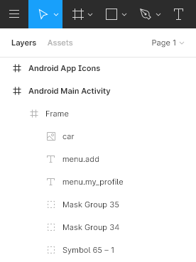
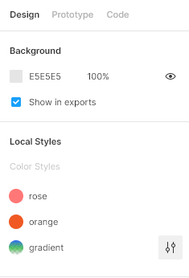
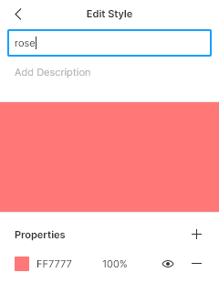
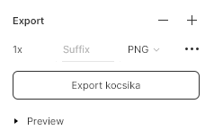

# 🛑 Docs out-of-date notice! 🛑
This documentation is not updated anymore. 
All documentation of Respresso moved to https://respresso.io/docs.
## ✔️ Up-to-date docs of the Figma plugin is here:
| Content                       | Link                                                                         |
| ----------------------------- | -----------------------------------------------------------------------------|
| Installation + Usage          | https://respresso.io/docs/integration-figma-plugin                           |
| Config options                | https://respresso.io/docs/integration-introduction                           |
| Localization specific options | https://respresso.io/docs/localization/figma-plugin                          |
| Image specific options        | https://respresso.io/docs/image/figma-plugin                                 |
| Color specific options        | https://respresso.io/docs/color/figma-plugin                                 |
| App icon specific options     | https://respresso.io/docs/app-icon/figma-plugin                              |

## Seriously, 🛑 stop 🛑 here and go to the [new docs](https://respresso.io/docs/integration-figma-plugin)!

---

[

](https://respresso.io)  

# Export assets from Figma with Respresso Figma plugin   
 
## Introduction
[Respresso](https://respresso.io) is a digital asset handler, which automatically transforms and delivers assets into your project. Digital assets, such as: localization strings, images, colors, app icons. Now, we created an integration tool for you to easily export your assets from [Figma](https://www.figma.com) to [Respresso](https://app.respresso.io). Attention, you cannot import these assets from Respresso to Figma. OK, let's see how to use it.
 
## Integration settings
 
#### Server address
	
 Basically, it is https://app.respresso.io. Change this address if you have an own Respresso server.
 
#### Integration token
	
Respresso has an integration token for importing data from outside tools. This token isn't the same with your project token. You will find this token in the path of Project settings/Integration options.
	
#### Export mode
This is a simple option to choose a comfortable way of exportation. You can export all of your artboards or only the selected items.
	
#### Localization
Plugin will export your localization texts if you leave the tick in the rect. These texts have a key and value pair inside Figma. Value is a simple text that you can write into a textbox. Key is more complicated than value. You will find this under the Layers tab. Click on the textbox and check the Layer tab. In that you can modify the key with a double click on the textview with a T symbol. Respresso suggests a key usage like these:
	
* section.name_of_the_function.name_of_element (main.menu.log_out)
* section_name_of_the_function_name_of_element (main_menu_log_out)
* connected_to.function_name_of_element (user.log_out)
* etc.
	

 
Sometimes designers have to modify localization inside the designer tool. We are motivated to help you and for developers that is why you can reimport all of your localization texts. Let see how can we handle it:
 1. Modifying the value is the simplest case. Respresso will follow the modification.
 2. Key modification not acceptable function through export. Respresso will skip this request. 
 3. Remove isn't acceptable as well (through export process).
 
 Sometimes you would like to skip some texts. In that case add this command: *#respresso-ignore* to the text's key field.
	
#### Color
Respresso plugin can export your colors from Color Styles. Export all of your colors from artboards not an option, please use Color Styles. Respresso supports solid and gradient colors, although gradient colors will split by parts of colors and Respresso exports them like solid colors. Local Styles support key and value pairs. You can modify the key of the color with double click on the color under Local Styles/Color Style section.
 

	
	

 
Respresso supports the modification of the color. Change the value and reimport the project. Key modification isn't supported. If you leave the key of the color blanket or you try to import a color with existing key (into Respresso) Respresso can change the name of the key. Our small AI makes a prediction to determine the name of the color.
	
#### Image
You can export images with a simple solution. Select an image and add an export option under Design section. Inside the export you can choose a zoom option (0.5x, 1x, 2x etc.), suffix and file format. Respresso supports all file formats from Figma but we would like to suggest svg type. Images have keys as well and you can modify it after a double click on the image. After that Figma opens a Layer window and selects the item. Suffix value will place the end of the key. 
 

Sometimes an image is splitted by an edge of the artboard inside your design. Respresso will get the original image instead of the splitted one. To avoid this situation use the Clip content possibility among artboard Frame settings. To find this option select the artboard and look at the Design tab. Image modification is fully supported.
	
#### App Icon
Create your app's icon(s) in Figma. Respresso plugin supports Simple and Background - Foreground icons. To import app icons into Respresso you have to add an export option under Design section and use specific keys for images.
 
* Singe icon key: App icon single
* Background icon: App icon background
* Foreground icon: App icon foreground
 
Modification is supported as well.
 
## Integration config
 
Configuration windows show basic information about a team and project. You can select a version for each digital asset, which was selected previously. 
 
## Change Log
 
Change log contains all modifications (create or update) about the project. This may help you to follow the import process.
